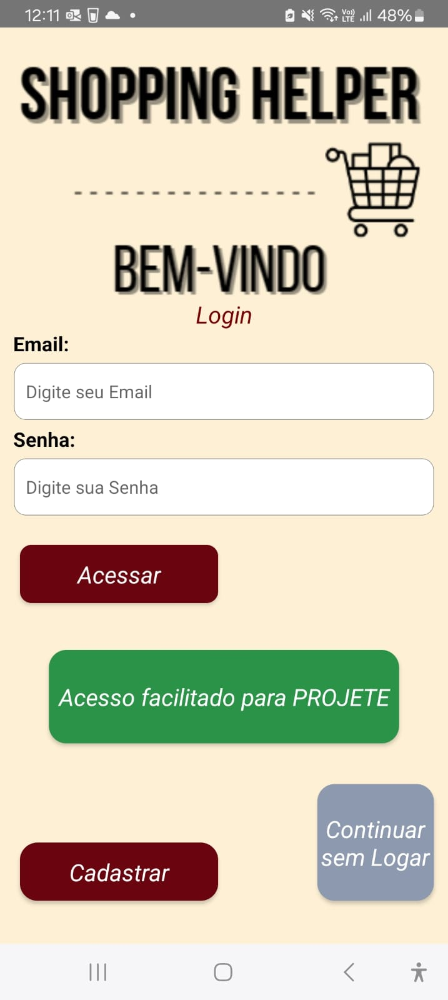
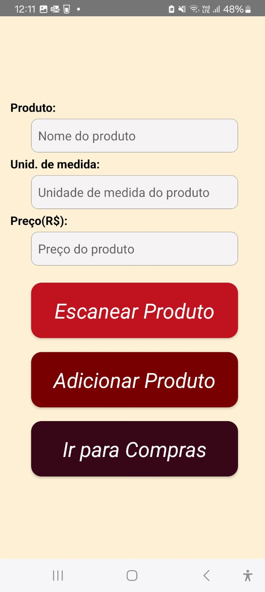
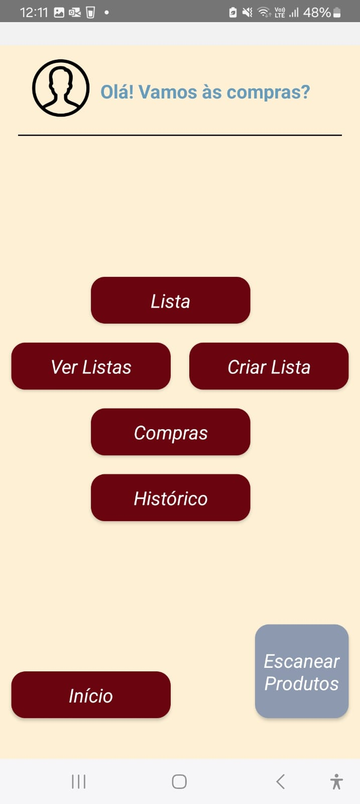

🛒 Shopping Helper

Projeto desenvolvido para ajudar usuários a organizarem suas listas de compras de maneira prática e categorizada. A aplicação permite adicionar produtos, selecionar categorias e gerenciar os itens de forma interativa.

Objetivo:

Este projeto foi criado para PROEJTE, feira de técnologia da ETE FMC, mas me permitiu praticar:
- Lógica de programação
- Manipulação de DOM com JavaScript
- Estruturação de páginas com HTML e CSS
- Organização de tarefas em listas e categorias

Tecnologias utilizadas:

- HTML5
- CSS3
- JavaScript (puro)
- Firebase (para testes de persistência, atualmente desativado)

Status do projeto:

⚠️ A funcionalidade de banco de dados (Firebase) está temporariamente indisponível, pois o ambiente gratuito expirou.  
Apesar disso, o código continua disponível para análise de lógica e estrutura.

O que eu aprendi:

Esse projeto foi um dos meus primeiros contatos com JavaScript de forma mais prática.  
A partir dele, aprendi a:
- Criar interfaces interativas com eventos
- Organizar melhor meu código
- Pensar no usuário final e na utilidade da aplicação

Acesse o projeto:
[🔗 Clique aqui para abrir o Shopping Helper no GitHub Pages](https://laiscr.github.io/Shopping_Helper/)

Prévia do projeto:

Tela Inicial

Tela de Inserção de Produto

Alerta de Produto Não Escaneado

